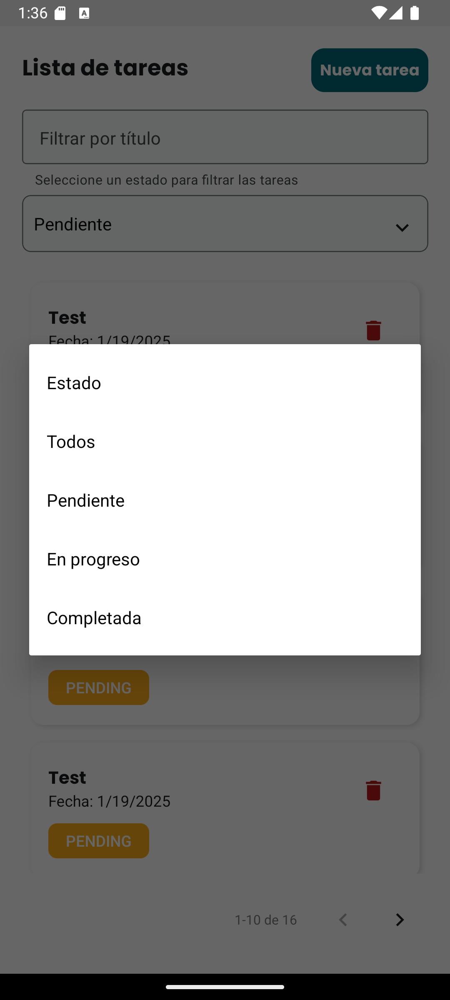
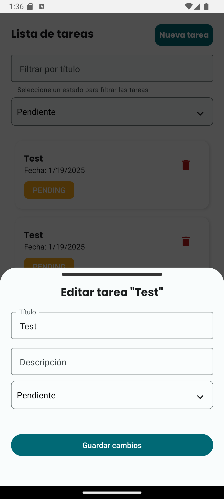

# Proyecto Frontend - Gestión de Tareas

Este proyecto es la parte frontend de la aplicación de gestión de tareas. Utiliza React Native junto con TypeScript y la librería React Native Paper para crear una interfaz interactiva y moderna para gestionar tareas. Se conecta con el backend mediante APIs RESTful para obtener, crear, editar y eliminar tareas.

## Instalación

Para ejecutar este proyecto, asegúrate de tener Node.js y npm.

1. Clona el repositorio:

   ```bash
   git clone https://github.com/fabrizioCast/tasks-front.git
   cd tasks-front
   ```

2. Instala las dependencias:

   ```bash
   npm install
   ```

3. Completa las variables de entorno en el archivo `.env`:

   ```bash
   EXPO_PUBLIC_API_URL=
   ```

4. Inicia el servidor de desarrollo:

   ```bash
   npm start
   ```

## Estructura del Proyecto

- **src**: Contiene todo el código fuente de la aplicación.
  - **components**: Componentes reutilizables de la UI.
  - **hooks**: Hooks personalizados, como `useTask` para la gestión de tareas.
  - **screens**: Las pantallas principales de la aplicación, como `TaskScreen`.
  - **services**: Servicios para la interacción con la API backend, como `TaskService`.
  - **interface**: Tipos de datos y interfaces de TypeScript, como `TaskProps`.
- **App.tsx**: El punto de entrada de la aplicación.

## Funcionalidades

- **Lista de tareas**: Visualiza las tareas con paginación y filtros por estado.
- **Creación de tareas**: Agrega nuevas tareas mediante un formulario modal.
- **Edición de tareas**: Modifica las tareas existentes con un formulario modal.
- **Eliminación de tareas**: Elimina tareas con confirmación.
- **Filtros de estado**: Filtra las tareas por estado (Pendiente, En Proceso, Completada).

## Imagenes







